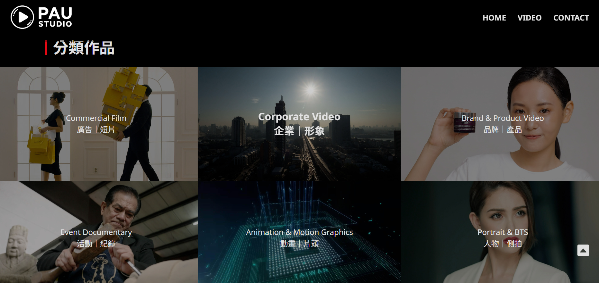

## 開發框架：
### 前端：


- **Vue3**：前端框架搭配 `pinia` 套件進行狀態管理
- **Boostrap**：`CSS 樣式`管理
- **Vite**：建構工具

### 後端 API：


- **Vercel**：`Severless API`部署平台
- **Express**：整合 Youtuber API 資訊
- **Youtube**：串接後台

### 前端部署：

- **Github Page**：串接 `正式DNS`

## 相關連結：
- **正式平台網址**：https://paustudio.net/
<div style="max-width:500px">
    
</div>

## 主要功能：
1. **前台**：提供使用者查閱 Studio 作品資訊
2. **API**：提供前台串接 Youtube 後台影片與 setting 資料

## 專案架構
```
├── eslint.config.js
├── index.html
├── jsconfig.json
├── package-lock.json
├── package.json
├── public
├── src
|  ├── App.vue
|  ├── assets
|  |  ├── base.css
|  |  ├── globalData.js
|  |  └── style.css
|  ├── components
|  |  ├── BrandSlider.vue
|  |  ├── BtnItem.vue
|  |  ├── CategoryImgCard.vue
|  |  ├── ContactInfo.vue
|  |  ├── Footer.vue
|  |  ├── Header.vue
|  |  ├── IconCard.vue
|  |  ├── icons
|  |  ├── IntroCard.vue
|  |  ├── Loading.vue
|  |  └── ToTop.vue
|  ├── main.js
|  ├── router
|  |  └── index.js
|  ├── stores
|  |  └── video.js
|  └── views
|     ├── CategoryView.vue
|     ├── ContactView.vue
|     ├── HomeView.vue
|     └── ProductView.vue
└── vite.config.js
```